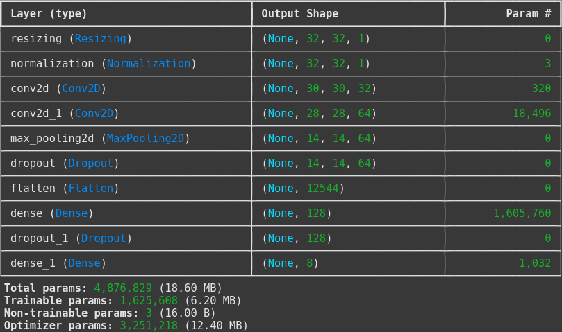
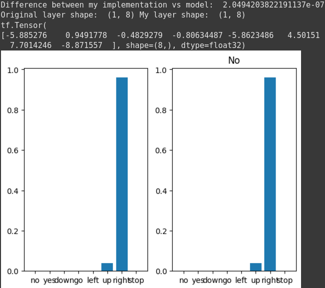

# Implementations of some CNN layers
## Overview
The purpose of this project was to make own implementations of CNN layers and get the same or close results with the model 
[Reference model](https://www.tensorflow.org/tutorials/audio/simple_audio)

## Results
All layers from normalization up to dense_1 were implemented with the same result, except for resizing

